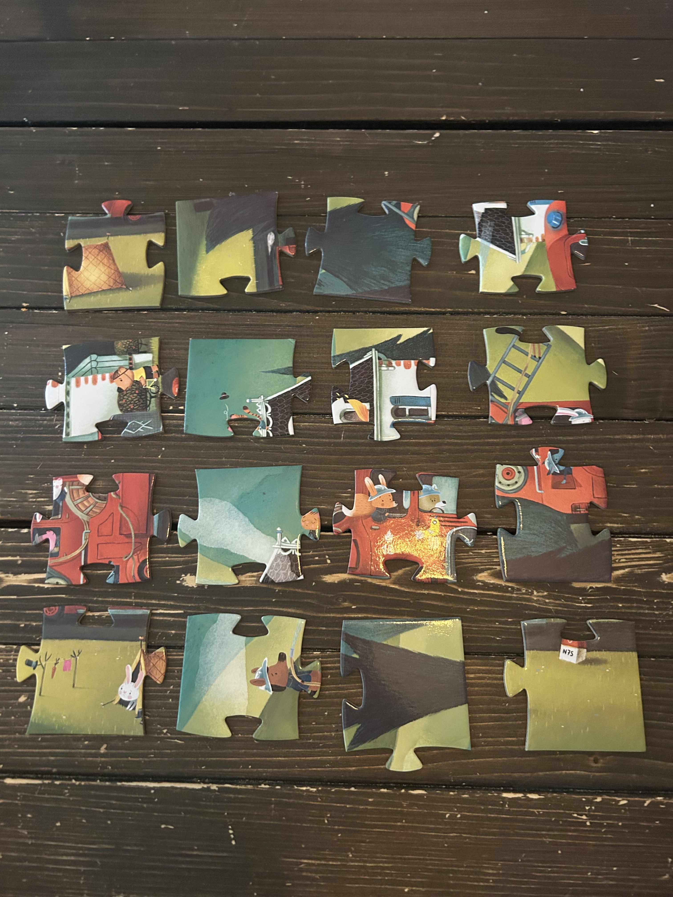

# Puzzle Prompt Challenge

This repository explores the capabilities of Large Language Models (LLMs) in solving simple physical puzzles compared to human toddlers.

## Background

I've noticed an intriguing situation: a young child can effortlessly solve simple puzzles, while current Large Language Models (LLMs) often struggle to provide clear, actionable, step-by-step solutions, even when given detailed prompts and photographs.

This repository documents a specific experiment to answer the question:

> Can we effectively prompt-engineer LLMs into clearly solving simple physical puzzles?

## Experiment

### Input Image



### Prompt

```
Here’s a picture of a child's puzzle. Please solve it in any way you see fit, but ensure the solution is obviously correct. I’d especially appreciate a generated image showing the puzzle completed, so it’s visually clear how all the pieces fit together.
```

### LLM Response (Output Image)


## How to Contribute

If you've tried similar experiments or have ideas about improving prompt effectiveness, contributions are welcome:
- Share your prompts and results.
- Suggest improvements or new experimental designs.
- Discuss findings and implications in GitHub issues.

## License

This project is open source, licensed under the MIT License.
